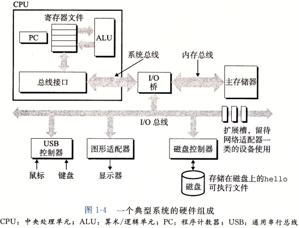
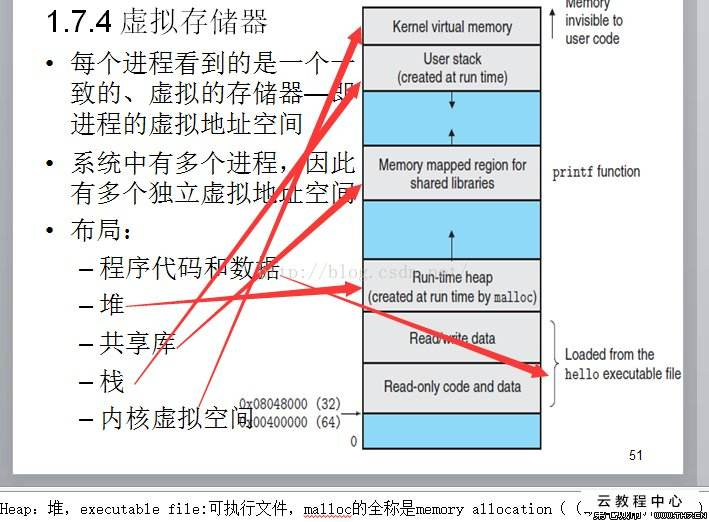

# A Tour of Computer System
## 1.1 Information is Bits and Context
The hello program
```C
#include<stdio.h>

int main()
{
    printf("hello word\n");
}
```
The source program is a sequence of bits, each with a value of 0 or 1, organized in 8-bits chunks called bytes. Each bytes represents some text character in the program(using ASCII standard).

```
# i n c l u d e
35 105 110 99 108 117 100 101
```
All information in a system respresented as a bunch of bits, based context and is different.

## 1.2 Programs Are Translated by Other Programs into Different Forms

C is High-level program, because it can be read and understand by human. C statements must be translated by Object programs into a sequence of **low-level machine-language** instructions

On UNIX/LINUX system, **complier driver** translate source file to object files.
```bash
unix> gcc -o hello hello.c
``` 
hello is executable object file, process containes: pre-processor,compliler,assembly,linker.

## 1.3 It Pays to Understand How Complilation System Work

Why we need to understand how complilation system work?
- Optimizing program performance 
- Understanding link-time errors(running error is scariest)
- Avoiding security holes 

## 1.4 Processors Read and Interpet Instructions
run hello program
```bash
unix> ./hello
hello word
unix>
```
### 1.4.1 Hardware Organization of a System

#### buses(总线)

Electrical conduits carray bytes of information back and forth between the components. Buses are typically designed to transfer fixed-sized chuncks of bytes konwn as **words**, such as 32-bits or 64-bits, there we assume a word is size of 4 bytes(32-bits)

#### I/O devices(输入输出设备)

- Input devices: keyboard,mouse.
- Output devices: display,disk driver.

Each I/O devices is connected to the I/O buses

#### Main memary(主存储器)

The main is a temporary storage device that holds both a program and the data it manipulates while the processor is executing the program. main memary consists of a collections of **dynamic random access memory**(DRAM) chips.

#### processor(处理器)
**The central processing unit**(CPU), is the engine that interprets(executes) instructions stored in main memory. Contains: 
- Program Counter
- Register
- Arithetic/Logic Unit
- Buses Interface

Some basic instruction which CPU carry out:

- Load: Copy a byte/word from main memory to register, overwriting.
- Store: Copy a byte/word from register to a location in main memory.
- Operate: Copy the contents of two registers to the ALU, perform a arithmetic operation on the two words, and store result in a register, overwriting.
- Jump: Excract a word from the instruction itself and copy the word into the PC.

### 1.4.2 Running the hello Program
Read form keyboard instruction and execute hello program.
## 1.5 Caches Matter
A system spends a lot of time moving information from one place to another.Thus a major goal is to make these copy operations run as fast as possible.

Fast devices are more exepensive. and process and memory has gap.

To deal with the processor-memory gap, a small faster storage devices included named **cache memory/caches**, between bus interface and register. cache (SRAM, Static Random Acess Memory)

### 1.6 Storage Devices Form a Hierarchy(分层制度)
1. CPU
2. L1 Cache
3. L2 Cache
4. L3 Cache
5. Main Memory
6. Local Secondary Storage(local disk)
7. Remote Secondary Storage(distributed file system, web server)

### 1.7 The Operating System Manages the Hardware

Running hell program based on Operating System.
#### 1.7.1 Processes

A *process* is the operating system's abstraction for running program.
process a and process b can **context switching**

#### 1.7.2 Thread
 In modern systems, a process can actually consists of multiple execution units, call threads,each running in the context of the context of the process and sharing the same code and global data.
 - Easier to share data
 - efficient
 - Faster

 #### 1.7.3 Vitual Memary
 Virtual memory is an abstraction that povides each process with the illusion that it has exclusive(独占的) use of the main memory. Each process has the same uniform view of memory, which is known as virtual address space(虚拟地址空间).
 
 - **Heap** The code and data areas are followed immediately by the run-time heap.
 the heap expands and contracts(合同,收缩) dynamically at run time as call malloc and free function.
 - **Shared Libraries** code and data for shared libraries such as C standard library and the math library.
 - **Stack** At the top of the user's virtual adress is the user stack that the compliler use to implements function calls. expands and contracts dynamically.
 - **Kernel virtual memory** The kenel is part of operating system that is always resident(居民,驻扎) in memory. App not allowed read or write the contents of this areas.
 #### 1.7.4 Files
 The files is a sequence of bytes, nothing more and nothing less. Every I/O device is modeled as a file.All input and output is performed by reading and writing files.
 ### 1.8 Systems Communicate with Other Systems Using Networks
 system links other systems, a network can be viewed as just another I/O devices.
 ### 1.9 Important Themes 
 System is hardware and software collections to running program.
 #### 1.9.1 Concurrency and Parallelism
 Thread-Level Concurrency

 Instruction-Level Parallelism
 #### 1.9.2 The Importance of Abstractions in Computer Systems
 - files
 - virtual memory
 - processes
 ### 1.10 Summary
 - Hardware
 - Software


